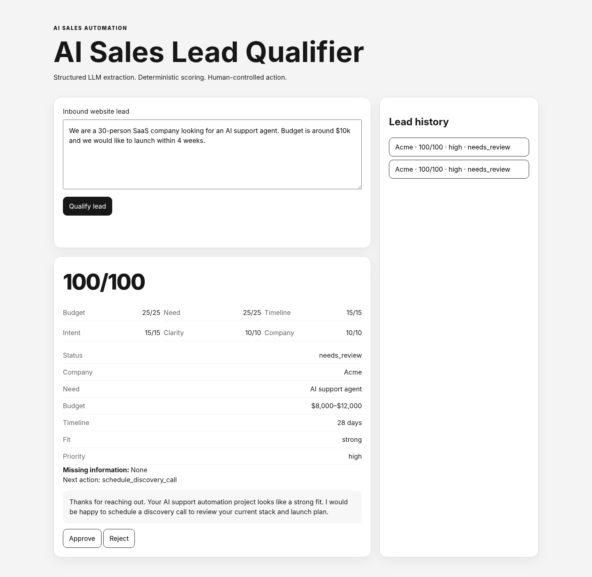

# AI Sales Lead Qualifier

**AI-powered lead qualification with structured LLM extraction, deterministic scoring, human approval, and an auditable FastAPI backend.**

[](https://github.com/dmytrodyakonov98-tech/ai-sales-lead-qualifier/actions/workflows/ci.yml)




## The problem

Inbound leads are messy. A sales team often needs to turn free-form requests into structured facts, decide whether the opportunity is worth pursuing, identify missing information, and prepare the next response — without allowing an LLM to invent the business decision.

This project demonstrates a safer pattern:

> **LLM extracts and drafts. Code decides.**

The model handles probabilistic language tasks. Deterministic Python rules own scoring, fit, priority, missing-information detection, next-best-action selection, lifecycle transitions, and approval semantics.

## What the system does

1. Accepts a raw inbound website lead.
2. Extracts typed sales facts with an LLM.
3. Validates AI output with Pydantic.
4. Calculates six deterministic score components and a reproducible `0–100` total.
5. Maps the result to fit and priority using fixed thresholds.
6. Detects missing decision-relevant information.
7. Chooses the next best action with deterministic Python rules.
8. Generates a grounded response draft.
9. Persists the lead, analysis, draft, lifecycle state, and audit events in SQLite.
10. Requires a human to approve or reject the draft.
11. Never sends an external message in v1.

## Why this is more than a chatbot

The LLM cannot override the score or the workflow state. The same validated facts always produce the same deterministic qualification result.

```text
Raw lead
   │
   ▼
LLM structured extraction
   │
   ▼
Pydantic validation
   │
   ├──► deterministic scoring
   ├──► missing-information detection
   └──► deterministic next-action rules
                │
                ▼
          LLM grounded draft
                │
                ▼
        Human approve / reject
                │
                ▼
       SQLite + audit events
```

## Deterministic scoring

| Component | Maximum |
|---|---:|
| Budget fit | 25 |
| Need fit | 25 |
| Timeline fit | 15 |
| Decision intent | 15 |
| Project clarity | 10 |
| Company fit | 10 |
| **Total** | **100** |

Fixed thresholds:

- `0–39` → weak / low
- `40–69` → moderate / medium
- `70–100` → strong / high

The boundary values `39/40/69/70` and scoring buckets are covered by automated tests.

## Human approval boundary

Every generated draft starts as `pending`.

A review changes the draft state, lead state, and audit event atomically. A second review attempt returns HTTP `409` instead of silently replacing the first decision.

Approval is a workflow state only. **No email, CRM update, webhook, or other external action is performed in v1.**

## Demo flow

Example inbound lead:

> We are a 30-person SaaS company looking for an AI support agent. Budget is around $10k and we would like to launch within 4 weeks.

The dashboard returns:

- structured lead facts;
- six score components;
- total score and fit/priority;
- missing information;
- deterministic recommended action;
- grounded response draft;
- Approve / Reject controls;
- persistent lead history.

The verified hero run shown above produced `100/100`, `strong` fit, `high` priority, and `schedule_discovery_call`.

## Tech stack

- Python 3.12+
- FastAPI
- Pydantic v2
- OpenAI Responses API with typed structured output
- SQLite
- Vanilla HTML / CSS / JavaScript
- pytest + FastAPI TestClient / httpx
- GitHub Actions CI

## API

| Method | Endpoint | Purpose |
|---|---|---|
| `GET` | `/health` | Health check |
| `POST` | `/api/leads` | Create and qualify a lead |
| `GET` | `/api/leads` | List persisted lead summaries |
| `GET` | `/api/leads/{lead_id}` | Fetch persisted lead detail |
| `POST` | `/api/leads/{lead_id}/draft/approve` | Approve pending draft |
| `POST` | `/api/leads/{lead_id}/draft/reject` | Reject pending draft |

Stable error semantics include `404` unknown lead, `409` invalid lifecycle transition, `422` transport validation, `502` unusable/provider LLM failure, and controlled `500` errors.

## Local setup

Python 3.12+ is required.

```bash
python -m venv .venv
```

Windows PowerShell:

```powershell
.venv\Scripts\Activate.ps1
python -m pip install --upgrade pip
python -m pip install -e ".[dev]"
Copy-Item .env.example .env
```

macOS / Linux:

```bash
source .venv/bin/activate
python -m pip install --upgrade pip
python -m pip install -e ".[dev]"
cp .env.example .env
```

Set an OpenAI key in `.env` for real-model lead processing:

```dotenv
LLM_PROVIDER=openai
OPENAI_API_KEY=your_key_here
LLM_MODEL=gpt-5.6-luna
DATABASE_URL=sqlite:///./data/leads.db
APP_ENV=development
```

Start the application:

```bash
python -m uvicorn app.main:app --reload
```

Open `http://127.0.0.1:8000`.

## Tests

Tests use a deterministic `FakeLLMClient`, require no API key, and make no model calls.

```bash
pytest -q
```

The 54-test suite covers:

- domain validation invariants;
- all deterministic scoring buckets;
- `39/40/69/70` thresholds;
- repeated deterministic scoring;
- missing-information detection;
- next-action ordering;
- malformed structured LLM output;
- grounded drafting;
- SQLite reopen/persistence;
- pipeline success and controlled failure paths;
- API contracts and stable public errors;
- approve/reject and double-review protection;
- dashboard serving;
- high-quality, incomplete, unrelated, and malformed-provider scenarios.

GitHub Actions performs the documented install command in a fresh Python 3.12 runner before running the suite.

## Repository structure

```text
app/
  api/          FastAPI routes and dependencies
  llm/          LLM protocol, prompts, typed OpenAI adapter
  models/       domain, persistence, and API contracts
  services/     extraction, scoring, qualification, recommendation, drafting, review, pipeline
  storage/      SQLite schema and repository adapter
frontend/       static dashboard
tests/          unit, integration, and deterministic fake-LLM fixtures
docs/screenshots/
.github/workflows/ci.yml
```

## Failure handling

Invalid AI output fails closed. Provider/schema exceptions are normalized into typed application errors. Public API responses do not serialize provider exception messages, tracebacks, or secrets.

If processing fails after lead creation, the lead is marked `failed`, a `pipeline_failed` audit event is stored, and no approved draft is created.

## Portfolio proof

This repository demonstrates:

- AI workflow development with Python and FastAPI;
- structured LLM outputs with Pydantic validation;
- separation of probabilistic AI behavior from deterministic business rules;
- explainable lead scoring and deterministic next-action logic;
- human-in-the-loop approval;
- persistence and audit events;
- controlled failure handling;
- automated unit/integration testing and clean-install CI.

## v1 scope

This version intentionally does **not** include authentication, billing, RAG/vector databases, multi-agent orchestration, autonomous external actions, webhooks, background queues, Gmail sending, or CRM integrations.

Those are possible future integrations, not claims about the current implementation.
